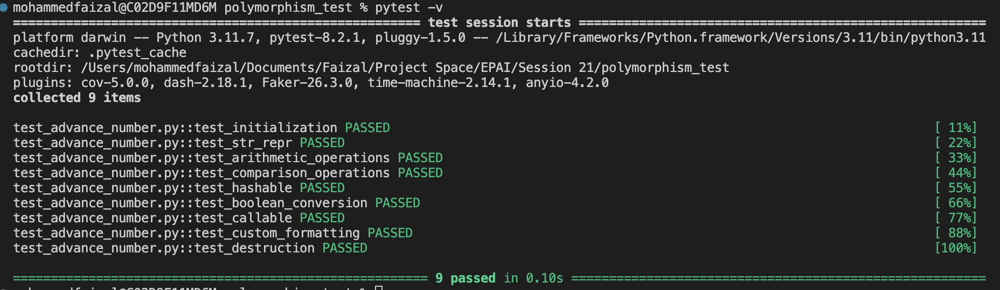

# AdvancedNumber: Exploring Polymorphism and Special Methods in Python

The `AdvancedNumber` class demonstrates how to use **special methods** in Python to create a custom numerical type that behaves like built-in types, while also introducing the concept of **polymorphism**.

This class serves as a learning tool for understanding how to customize object behavior in Python using special methods.

---

## Key Features of `AdvancedNumber`

1. **String Representations (`__str__` and `__repr__`)**  
   - `__str__`: Returns a user-friendly description of the object.  
     Example: `"Value: 5"`  
   - __str__ is specifically for print() or str(obj) when you want a user-friendly representation.
   
   - `__repr__`: Returns a developer-friendly string for debugging.  
     Example: `"AdvancedNumber(5)"`
    - __repr__ is primarily for repr(obj) or when you're debugging in an interpreter or logging.

2. **Arithmetic Operations (`+`, `-`, `*`, `/`, `%`)**  
   - Supports operations with other `AdvancedNumber` objects or plain numbers (`int`/`float`).  
     Example:  
     ```python
     obj1 = AdvancedNumber(10)
     obj2 = AdvancedNumber(5)
     print(obj1 + obj2)  # Value: 15
     print(obj1 - 3)     # Value: 7
     ```

3. **Comparison Operations (`<`, `<=`, `>`, `>=`, `==`, `!=`)**  
   - Allows comparisons with other `AdvancedNumber` objects or plain numbers.  
     Example:  
     ```python
     obj1 = AdvancedNumber(10)
     obj2 = AdvancedNumber(5)
     print(obj1 > obj2)  # True
     print(obj1 == 10)   # True
     ```

4. **Hashable (`__hash__`)**  
   - Objects can be used as keys in dictionaries or members of sets.  

5. **Boolean Conversion (`__bool__`)**  
   - Returns `True` if the value is non-zero, `False` otherwise.  
     Example:  
     ```python
     print(bool(AdvancedNumber(0)))  # False
     print(bool(AdvancedNumber(10)))  # True
     ```

6. **Callable Behavior (`__call__`)**  
   - Objects can be called like functions to return their value squared.  
     Example:  
     ```python
     obj = AdvancedNumber(4)
     print(obj())  # 16
     ```

7. **Custom Formatting (`__format__`)**  
   - Supports formatted strings for specific use cases:  
     - `{:.2f}`: Two decimal places for floats.  
     - `{:#x}`: Hexadecimal representation for integers.  
     Example:  
     ```python
     obj = AdvancedNumber(255)
     print(format(obj, ".2f"))  # 255.00
     print(format(obj, "#x"))   # 0xff
     ```

8. **Destructor (`__del__`)**  
   - Prints a message when an object is destroyed, useful for understanding object lifecycle.  
     Example:  
     ```python
     obj = AdvancedNumber(5)
     del obj  # Prints: "AdvancedNumber with value 5 is being destroyed"
     ```

---

## What is Polymorphism?

**Polymorphism** allows objects of different types to be treated uniformly. In `AdvancedNumber`, this is achieved by:
- Overloading operators (`+`, `-`, etc.) to handle both `AdvancedNumber` and plain numbers.
- Adapting methods like `__format__` to different formatting styles (`.2f`, `#x`, etc.).
- Using the `__call__` method to provide a unique behavior when the object is used like a function.

Example of polymorphic behavior:
```python
obj1 = AdvancedNumber(10)
obj2 = AdvancedNumber(5)

# Works with AdvancedNumber
print(obj1 + obj2)  # Value: 15

# Works with plain numbers
print(obj1 + 3)  # Value: 13
```

---

## Example Usage

Here’s how you can use the `AdvancedNumber` class:

```python
obj1 = AdvancedNumber(10)
obj2 = AdvancedNumber(5)

# Arithmetic operations
print(obj1 + obj2)  # Value: 15
print(obj1 * 2)     # Value: 20

# Comparison
print(obj1 > obj2)  # True

# Callable behavior
print(obj1())  # 100

# Custom formatting
print(format(obj1, ".2f"))  # 10.00
print(format(obj1, "#x"))   # 0xa

# Boolean conversion
print(bool(obj1))  # True
```


## Testing

The functionality of `AdvancedNumber` is thoroughly tested using **pytest**. Key tests include:

1. **Initialization**: Ensures proper object creation.
2. **String Representation**: Verifies `__str__` and `__repr__`.
3. **Arithmetic and Comparison**: Checks correctness of operations.
4. **Hashing and Boolean Conversion**: Confirms hashability and truthiness behavior.
5. **Callable Behavior**: Tests squaring functionality.
6. **Custom Formatting**: Validates decimal and hexadecimal formatting.
7. **Destructor Behavior**: Ensures destruction message is printed.

To run the tests:
```bash
pytest test_advanced_number.py
```
### Test Results


